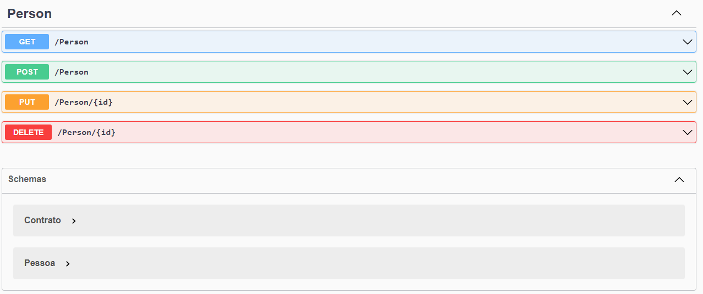

<h1>Web API</h1>

Criada para estudos, utilizando EntityFramework, esta WEB API é um controle de pessoas e contratos.

Nela é possível criar, pesquisar, atualizar e deletar as informações.

Como não foi utilizado banco de dados, as informações são apagadas ao encerrar a API.

